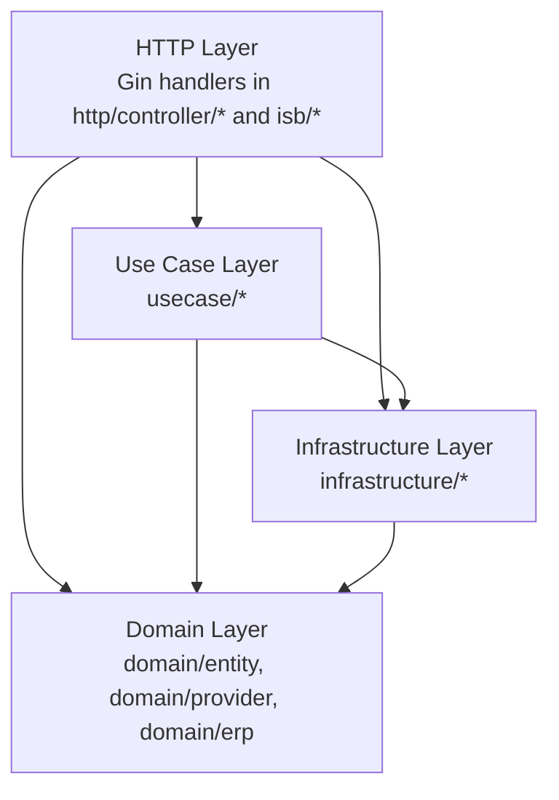

[Docs](../README.md) / Architecture

# Architecture Overview

imlate is a Go application that tracks visitor and student sign-in/sign-out events, with an optional integration to iSAMS (school management ERP). It follows a layered architecture with clear separation between domain logic, use cases, HTTP delivery, and infrastructure.

## High-Level Components

```
cmd/app/main.go            Entry point, route registration, server start
internal/
  config/                  Environment-based configuration
  domain/
    entity/                Core data structures (User, Visitor, VisitTrack)
    provider/              Repository interfaces (contracts)
    erp/                   ERP client interface (abstraction over iSAMS)
  usecase/
    adminapi/              Admin business logic (users, visitors, reports)
    theme/                 Tracking page theme/customization logic
    tracking/              Student attendance tracking logic
    synchroniser/          ERP data sync (students, photos, codes)
  http/
    controller/adminapi/   Gin handlers for /admin-api routes
  isb/
    tracker/               Gin handlers for /track, /find-and-track
    search/                Gin handler for /search/:id
    visitor/               Visitor-related delivery helpers
  infrastructure/
    db/                    Database connection and auto-migration
    repository/            SQL implementations of provider interfaces
    http/auth/             JWT admin auth + terminal Bearer auth
    integration/isams/     iSAMS OAuth2 REST client
    gocontainer/           Dependency injection wiring
    cron/                  Scheduled jobs (ERP sync, mark absent)
    logging/               Zap logger setup
    util/                  Time helpers, file utilities
website/                   Static UI assets (reader, admin SPA)
migrations/                SQL migration files (golang-migrate)
```

## Layered Architecture



- **Domain** defines entities and interfaces. It has no dependencies on other layers.
- **Use Case** contains business logic orchestration (report generation, student tracking, ERP sync).
- **HTTP** contains Gin handler functions that parse requests, call use cases or repositories, and return JSON responses. Admin API controllers live in `internal/http/controller/adminapi`; terminal/public handlers remain in `internal/isb/*`.
- **Infrastructure** implements domain interfaces (repositories, ERP client) and provides cross-cutting concerns (DB, auth, cron, logging).

## Request Flow

A typical request through the system:

```
Client
  |
  v
Gin Router (cmd/app/main.go)
  |
  +--> Middleware (JWT or Terminal auth)
  |
  v
Handler (internal/http/controller/* or internal/isb/*)
  |
  +--> Use Case (internal/usecase/*)  [optional, for complex logic]
  |
  v
Repository (internal/infrastructure/repository/*)
  |
  v
MySQL (via database/sql)
```

For terminal tracking requests with ERP integration:

```
Terminal Device
  |
  v
POST /find-and-track  (Terminal auth middleware)
  |
  v
TrackerController.FindAndTrackHandler
  |
  +--> VisitorRepository.FindByKey()       -> MySQL
  +--> VisitorTrackRepository.Store()      -> MySQL
  +--> StudentTracker.Track()              -> iSAMS API (if student)
  |
  v
JSON Response
```

## Key Patterns

### Dependency Injection

The application uses [golobby/container](https://github.com/golobby/container) for DI. All singletons are registered in [`internal/infrastructure/gocontainer/gocontainer.go`](../../internal/infrastructure/gocontainer/gocontainer.go):

- `*config.Config`
- `*zap.SugaredLogger`
- `*sql.DB`
- `provider.VisitorRepository` (backed by `repository.Visitor`)
- `provider.VisitorTrackRepository` (backed by `repository.VisitorTrack`)
- `provider.UserRepository` (backed by `repository.UserMySQL`)
- `erp.Factory` (backed by `isams.ClientFactory`)
- `*tracking.StudentTracker`
- `*adminapi.AdminAPI`
- `*theme.Service`

Controllers and middleware use `container:"type"` struct tags and are filled via `container.MustFill` in `main.go`.

### Repository Interfaces

Domain interfaces in [`internal/domain/provider/`](../../internal/domain/provider/) define the contract. Infrastructure provides the SQL implementation. Tests use mock implementations from [`internal/domain/provider/providertest/`](../../internal/domain/provider/providertest/).

### ERP Abstraction

The `domain/erp` package defines `Client` and `Factory` interfaces. The only implementation is iSAMS (`internal/infrastructure/integration/isams/`). The `Config.IsERPIntegrated()` method gates all ERP-dependent behavior including cron jobs.

### Auto-Migration

Database migrations run automatically on application startup via `db.Open()`, which calls `MigrateUp` using golang-migrate. This ensures the schema is always current.

## See Also

- [Services / Package Map](services.md) -- Detailed breakdown of each package.
- [API Reference](../api/README.md) -- All HTTP endpoints.
- [Configuration](../getting-started/configuration.md) -- Environment variables.

Back to [Docs Index](../README.md)
