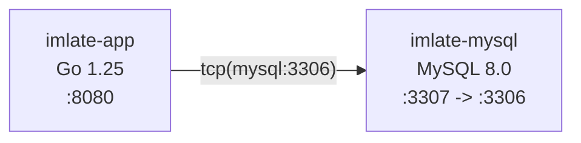

[Docs](../README.md) / Infrastructure

# Infrastructure

How the imlate development and production environments are set up, including Docker, CI, and database management.

## Docker Compose Topology

The development environment uses Docker Compose with two services:



### Services

| Service | Image | Container | Host Port | Description |
|---------|-------|-----------|-----------|-------------|
| `mysql` | `mysql:8.0` | `imlate-mysql` | `3307` | MySQL database with health check |
| `app` | Built from `docker/Dockerfile.dev` | `imlate-app` | `8080` | Go application with source mounted |

### Volumes

| Volume | Purpose |
|--------|---------|
| `mysql_data` | Persistent MySQL data |
| `go_modules` | Cached Go module downloads |

Source: [`docker-compose.yml`](../../docker-compose.yml)

### MySQL Initialization

On first start, MySQL creates:
- Database `tracker` (primary) with user `trackme`/`trackme`.
- Database `tracker_test` (for local testing), created by [`docker/mysql/init.sql`](../../docker/mysql/init.sql).

## Dockerfile Variants

### Production (`docker/Dockerfile`)

Multi-stage build:

1. **Builder stage** (`golang:1.25-bookworm`) -- downloads dependencies, compiles binary `tracker` with version injection via `-ldflags`.
2. **Runtime stage** (`debian:bookworm-slim`) -- minimal image with the binary, migrations, website assets, and storage directories. Installs `swag` and `migrate` tools. Runs `./tracker`.

Build argument `APP_VERSION` defaults to `2.0.x-dev` and can be overridden at build time.

### Development (`docker/Dockerfile.dev`)

Single-stage image based on `golang:1.25-bookworm` with full development tooling:

- `swag` -- Swagger generation
- `migrate` -- database migrations
- `golangci-lint` -- linting
- `air` -- hot reload (available but not used by default compose command)

The compose command runs migrations and then `go run cmd/app/main.go`.

## Docker Management Script

The [`docker/docker-dev.sh`](../../docker/docker-dev.sh) script is the primary interface for Docker operations. The `Makefile` delegates all commands to this script.

| Make Command | Script Command | Description |
|--------------|---------------|-------------|
| `make start` | `start` | `docker compose up -d --build` |
| `make stop` | `stop` | `docker compose down` |
| `make restart` | `restart` | Stop then start |
| `make restart-app` | `restart-app` | Restart only the app container |
| `make status` | `status` | Show container status |
| `make logs-app` | `logs app` | Tail app container logs |
| `make logs-mysql` | `logs mysql` | Tail MySQL logs |
| `make shell` | `exec bash` | Open bash in app container |
| `make got` | `got` | Run `go test ./...` in container |
| `make gotc` | `gotc` | Run tests with coverage |
| `make gol` | `gol` | Run `golangci-lint run` |
| `make golf` | `golf` | Run linter with `--fix` |
| `make build-app` | `build-app` | Build binary in container |
| `make dist` | `dist` | Build distributable binary |
| `make install-mod` | `install-mod` | `go mod download` |
| `make migrate-up` | `migrate-up` | Apply pending migrations |
| `make migrate-down` | `migrate-down` | Roll back last migration |
| `make migrate-create name=...` | `migrate-create <name>` | Create new migration pair |
| `make mysql-shell` | `mysql-shell` | Open MySQL CLI |
| `make clean` | `clean` | Remove containers, volumes, artifacts |
| `make rebuild` | `rebuild` | Clean rebuild of containers |
| `make swag` | (runs locally) | `swag init -g cmd/app/main.go ...` |

## CI Pipeline

GitHub Actions workflow: [`.github/workflows/go-tests.yml`](../../.github/workflows/go-tests.yml)

### Triggers

- Push to `main` or `develop`
- Pull requests

### Pipeline Steps

1. **Checkout** code.
2. **Set up Go** 1.25.7 with module caching.
3. **Download and verify** dependencies.
4. **Install** `migrate` CLI with MySQL tag.
5. **Run migrations** against `tracker_test` database via `scripts/migrate-test-db.sh`.
6. **Run tests** with `-race`, coverage profile (`coverage.out`).
7. **Upload coverage** to Codecov.
8. **Generate HTML** coverage report and upload as artifact.

### CI MySQL Service

The workflow starts a MySQL 8 container with:
- User: `imlate`/`imlate`
- Database: `tracker_test`
- Port: `3306` on `127.0.0.1`

## Database Migration Management

Migrations live in `migrations/` and use [golang-migrate](https://github.com/golang-migrate/migrate).

### Current Migrations

| Version | Description |
|---------|-------------|
| 000001 | Create visitors table |
| 000002 | Create track table |
| 000003 | Create visitor key table |
| 000004 | Add iSAMS ID and school ID to visitors |
| 000005 | Add year group and division to visitors |
| 000006 | Create users table (seeds default admin/terminal users) |
| 000007 | Add soft delete (deleted_at) to visitors |
| 000008 | Add admin fields (admin_id, description) to track; make key_id nullable |
| 000009 | Add created_by to users |
| 000010 | Update image URLs to storage path |

### Auto-Migration

`db.Open()` calls `MigrateUp` on every application start. If all migrations are applied, it is a no-op. This means deploying a new version with new migrations automatically updates the schema.

### Manual Migration Commands

```bash
make migrate-up                        # Apply pending migrations
make migrate-down                      # Roll back last migration
make migrate-create name=add-feature   # Create new up/down pair
```

Back to [Docs Index](../README.md)
